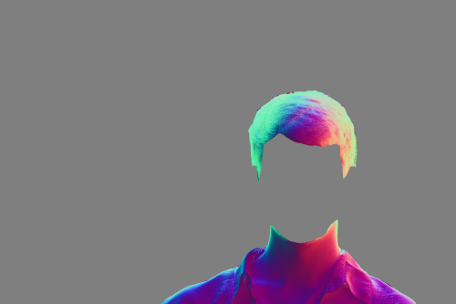
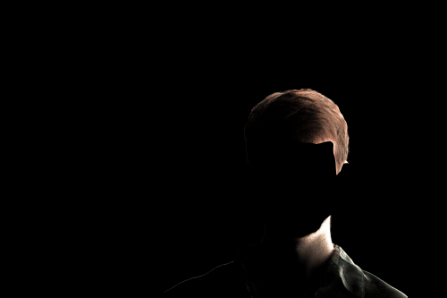
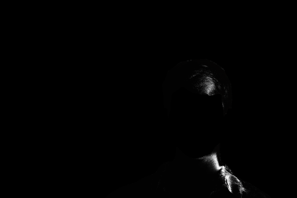
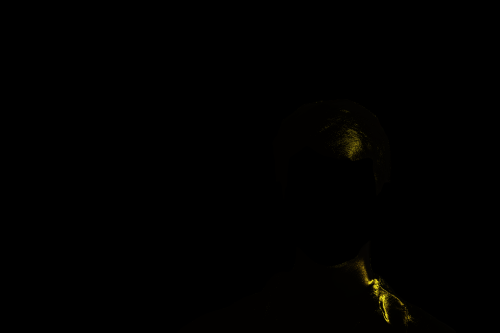

# Photometric Stereo with Spherical Gradient Illumination

This project demonstrates a lightweight photometric stereo pipeline for recovering high-quality **surface normals** from just **two RGB gradient images** and one **reference image**. Leveraging spherical-gradient illumination and the reflectance properties of human skin, we reconstruct a faithful normal map that enables realistic **relighting** and **material editing**.

The pipeline includes optional **Blinn–Phong relighting** for simulating white light motion, as well as stylized renderings with **metallic reflectance properties** (e.g., silver and gold). All outputs are high-resolution and animated as GIFs.

## Table of Contents

* [Core Idea](#core-idea)
* [Output](#output)
* [Capture & Input](#capture--input)
* [Pipeline Overview](#pipeline-overview)
* [Relighting Results](#relighting-results)
* [Project Structure](#project-structure)
* [Observations & Limitations](#observations--limitations)
* [References](#references)

## Core Idea

We use a **two-image spherical gradient photometric stereo setup**, where each RGB channel encodes one lighting gradient direction (X, Y, Z). Given a reference image under uniform illumination, we estimate the incoming light direction and recover per-pixel normals using a difference-over-sum strategy.

Since the two gradient images encode both positive and negative gradients, the estimated normal at each pixel is computed as:


A face mask is applied to restrict computation to relevant regions using semantic segmentation.

### Blinn–Phong Relighting

Once normals are estimated, we simulate relighting using a **Blinn–Phong reflectance model**, where lighting direction varies across frames. The rendering equation is:


Where detailed implementations can be found in `src/render.py`. The shader supports adjustable parameters for diffuse and specular coefficients, allowing for realistic skin rendering.

Stylized renderings use fixed metal RGBs (e.g., gold = `[1.0, 0.72, 0.06]`) and tuned parameters.

## Output

1. **Normal map**: RGB image representing per-pixel surface orientation.
2. **Albedo map**: Estimated diffuse reflectance (optional).
3. **Relighted face GIF**: Synthetic white light orbiting the face.
4. **Silver/Gold stylized GIFs**: Specular stylized renderings under identical motion paths.


## Capture & Input

* **Device**: Sony Alpha 6600 (RAW capture)
* **Lighting rig**: VCI spherical LED stage
* **Captured frames**:

  * `set01_gradient1.pgm`: +X+Y+Z lighting
  * `set01_gradient2.pgm`: -X-Y-Z lighting
  * `set01_image3.tiff`: Uniform full-bright image

## Pipeline Overview

| Stage              | Description                                   |
| ------------------ | --------------------------------------------- |
| RAW Decoding       | 16-bit linear Bayer demosaicing               |
| Image Registration | ORB keypoints + RANSAC homography warp        |
| Face Masking       | SegFormer face parsing model (12+ face parts) |
| Normal Estimation  | Difference-over-sum from RGB gradient pairs   |
| Relighting         | Blinn–Phong shader (adjustable)               |
| Material Editing   | Metal stylization using RGB coefficients      |


## Relighting Results
> For privacy reasons, only low-res gifs w/o face are shown.

### Extracted Normals


### White Light Relighting

* Reconstruct shading under a synthetic white directional light that circles the face.




### Material Style Transfer

* Replace human skin's appearance with **silver** or **gold**, rendered with strong specular reflection.

| Material | Preview                                                                         |
| -------- |---------------------------------------------------------------------------------|
| Silver   |  |
| Gold     |    |

All materials use the same Blinn–Phong shader with adjusted color/specular coefficients.

## Project Structure

```bash
project_root/
├── demo_resized/            # Results demonstrations (normals, relighting GIFs)
├── src/                     # Core processing code
│   ├── config.py            # Global paths, device, auxiliary parameters
│   ├── demosaic.py          # Bayer de-mosaic for RAW input
│   ├── align.py             # ORB + RANSAC based image alignment
│   ├── normal.py            # Normal & albedo estimation from RGB gradients
│   ├── mask.py              # SegFormer-based face mask generation
│   ├── light.py             # Light direction estimation from reference image
│   ├── render.py            # Shared Blinn–Phong rendering utilities
│   ├── main.py              # Full pipeline: demosaic → align → mask → normal
│   ├── relight_face.py      # Normal-based relighting (natural skin)
│   ├── relight_silver.py    # Stylized metallic relighting (silver)
│   └── relight_gold.py      # Stylized metallic relighting (gold)
```


## Observations & Limitations

* Normals are relatively of high quality due to spherical gradient design considering only two images were taken to obtain it
* face/material re-lighting results are visually effective despite simple shaders
* Minor artifacts exist when observing more carefully
* further Image-Based Lighting(IBL) not done yet and potential 3D depth reconstruction

## References
This project stems from the master lecture *Computational Photography* at University of Bonn taught by Prof. Matthias Hullin with the inspiration of the following resources:
* Woodham, Robert J. "Photometric method for determining surface orientation from multiple images." Optical engineering 19, no. 1 (1980): 139-144.
* Ma, Wan-Chun, Tim Hawkins, Pieter Peers, Charles-Felix Chabert, Malte Weiss, and Paul E. Debevec. "Rapid Acquisition of Specular and Diffuse Normal Maps from Polarized Spherical Gradient Illumination." Rendering Techniques 9, no. 10 (2007): 2.
* Guo, Kaiwen, Peter Lincoln, Philip Davidson, Jay Busch, Xueming Yu, Matt Whalen, Geoff Harvey et al. "The relightables: Volumetric performance capture of humans with realistic relighting." ACM Transactions on Graphics (ToG) 38, no. 6 (2019): 1-19.
* Debevec, Paul. "Image-based lighting." In ACM SIGGRAPH 2006 Courses, pp. 4-es. 2006.
* Xie, Enze, Wenhai Wang, Zhiding Yu, Anima Anandkumar, Jose M. Alvarez, and Ping Luo. "SegFormer: Simple and efficient design for semantic segmentation with transformers." Advances in neural information processing systems 34 (2021): 12077-12090.
* face-parsing: https://huggingface.co/jonathandinu/face-parsing